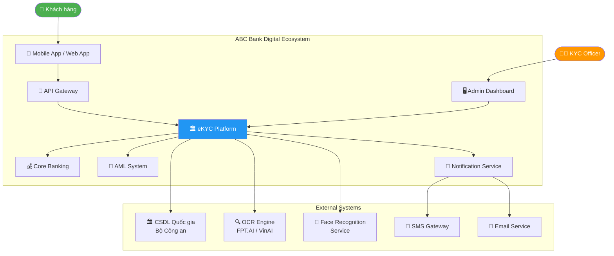
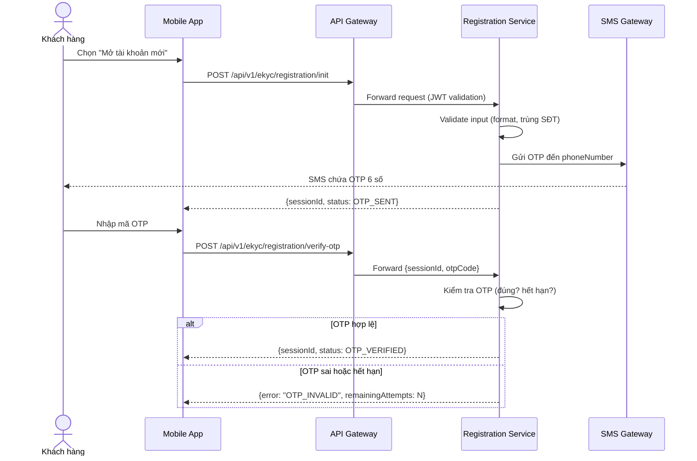
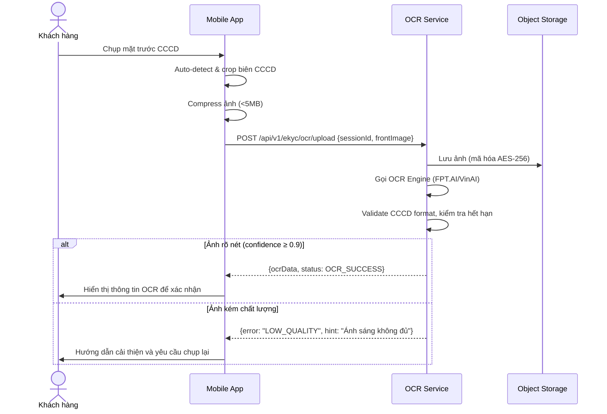
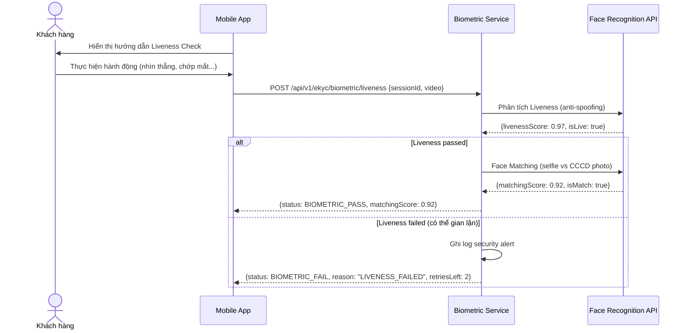
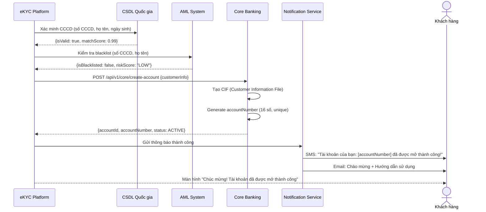
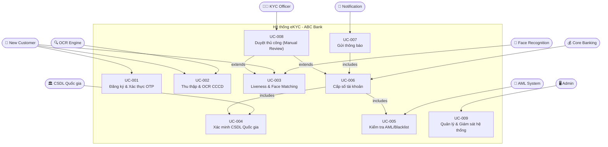
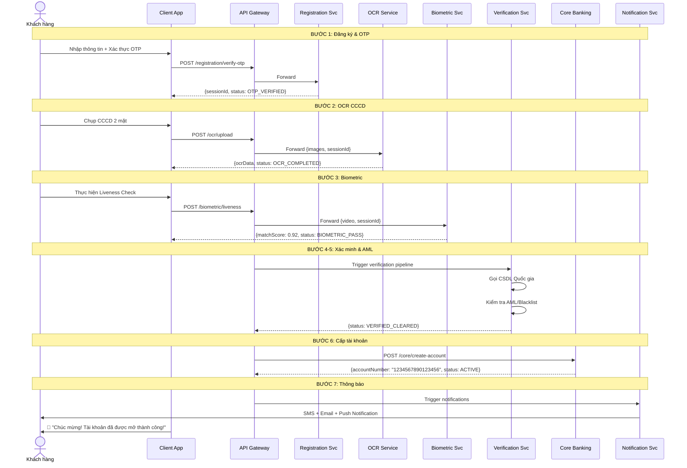
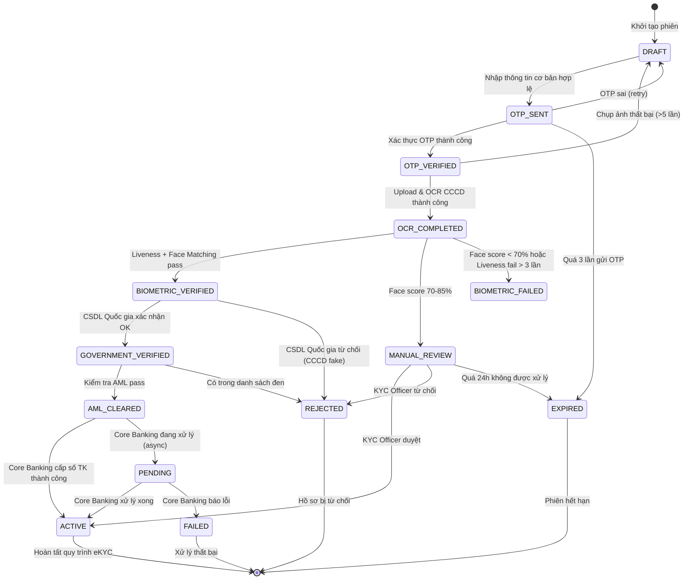
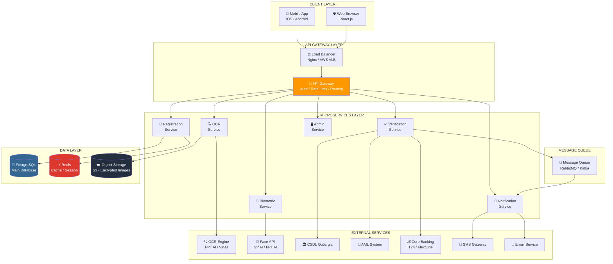

# TÀI LIỆU ĐẶC TẢ YÊU CẦU PHẦN MỀM
# SOFTWARE REQUIREMENTS SPECIFICATION (SRS)
## Hệ thống eKYC - ABC Bank Digital

---

**Số hiệu tài liệu:** SRS-EKYC-2026-001  
**Phiên bản:** 1.0  
**Ngày lập:** 2026-07-16  
**Trạng thái:** APPROVED  
**Soạn thảo bởi:** Team BA - ABC Bank Digital  
**Phê duyệt bởi:** CTO, Head of Compliance, Head of IT Security  

---

## MỤC LỤC

- [Phần 1: Introduction](#phần-1-introduction)
- [Phần 2: Overall Description](#phần-2-overall-description)
- [Phần 3: Specific Functional Requirements](#phần-3-specific-functional-requirements)
- [Phần 4: Non-Functional Requirements](#phần-4-non-functional-requirements)
- [Phần 5: Visual Diagrams](#phần-5-visual-diagrams)
- [Appendix](#appendix)

---

## PHẦN 1: INTRODUCTION

### 1.1 Purpose (Mục đích tài liệu)

Tài liệu SRS này mô tả đầy đủ và chính thức các yêu cầu phần mềm cho **Hệ thống eKYC (Electronic Know Your Customer)** của ngân hàng số ABC Bank. Đây là tài liệu kỹ thuật nền tảng (baseline document) được sử dụng làm căn cứ để:

- **Đội phát triển (Development Team)** hiểu rõ và xây dựng hệ thống đúng theo yêu cầu
- **Đội kiểm thử (QA/Testing Team)** thiết kế test case và test plan
- **Đội vận hành (Operations Team)** chuẩn bị hạ tầng và monitoring
- **Ban quản lý dự án (PM/PMO)** theo dõi tiến độ và kiểm soát phạm vi
- **Bộ phận pháp chế (Legal/Compliance)** xác nhận tuân thủ quy định pháp luật

Tài liệu này được viết theo chuẩn **IEEE 830-1998 (Software Requirements Specification)** có điều chỉnh cho phù hợp với đặc thù ngành ngân hàng Việt Nam.

### 1.2 Scope (Phạm vi hệ thống)

#### 1.2.1 IN-SCOPE (Trong phạm vi)

| # | Tính năng | Mô tả ngắn |
|---|-----------|-----------|
| 1 | Đăng ký thông tin cơ bản | Nhập họ tên, SĐT, email; xác thực OTP |
| 2 | Thu thập & OCR CCCD | Chụp và đọc dữ liệu từ 2 mặt CCCD |
| 3 | Liveness Detection | Phát hiện khuôn mặt thật (chống giả mạo) |
| 4 | Face Matching | Đối chiếu khuôn mặt với ảnh CCCD |
| 5 | Xác minh CSDL Quốc gia | Gọi API Bộ Công an xác minh tính xác thực CCCD |
| 6 | Kiểm tra AML/Blacklist | Đối chiếu với danh sách rửa tiền/cấm giao dịch |
| 7 | Cấp số tài khoản tự động | Tích hợp Core Banking để tạo tài khoản |
| 8 | Thông báo kết quả | SMS, Email, Push Notification |
| 9 | Manual Review Portal | Giao diện để nhân viên duyệt hồ sơ thủ công |
| 10 | Admin Dashboard | Báo cáo và giám sát hệ thống |

#### 1.2.2 OUT-OF-SCOPE (Ngoài phạm vi - Giai đoạn này)

- Mở thẻ tín dụng, vay vốn, bảo hiểm (các sản phẩm khác)
- Tích hợp với hệ thống quản lý rủi ro tín dụng (Credit Scoring)
- Ứng dụng cho doanh nghiệp (Corporate eKYC)
- Tính năng video call với nhân viên ngân hàng (Video KYC)
- Module quản lý đại lý (Agent Banking)

#### 1.2.3 Hệ thống tích hợp bên ngoài

```
eKYC Platform ↔ CSDL Quốc gia (Bộ Công an)
eKYC Platform ↔ Core Banking (T24/Flexcube)
eKYC Platform ↔ AML System (nội bộ hoặc bên thứ 3)
eKYC Platform ↔ SMS Gateway (VNPT, Viettel, FPT...)
eKYC Platform ↔ Email Service (SendGrid/SES)
eKYC Platform ↔ OCR Engine (FPT.AI/VinBigData/Viettel AI)
eKYC Platform ↔ Face Recognition Service (VinAI/FPT.AI)
```

### 1.3 Definitions, Acronyms, Abbreviations

| Thuật ngữ | Giải thích đầy đủ |
|-----------|------------------|
| **eKYC** | Electronic Know Your Customer - Quy trình nhận diện và xác minh danh tính khách hàng điện tử |
| **OCR** | Optical Character Recognition - Công nghệ nhận dạng ký tự quang học từ ảnh |
| **Liveness Check** | Kiểm tra khuôn mặt thật - Phát hiện người thật vs ảnh in/video replay/3D mask |
| **Face Matching** | Đối chiếu khuôn mặt - So sánh ảnh selfie với ảnh trên CCCD/giấy tờ |
| **AML** | Anti-Money Laundering - Chống rửa tiền |
| **OTP** | One-Time Password - Mật khẩu sử dụng một lần, gửi qua SMS |
| **CCCD** | Căn cước công dân (12 số) - Giấy tờ định danh mới nhất của Việt Nam |
| **NFC** | Near Field Communication - Giao tiếp không dây tầm gần, dùng để đọc chip CCCD |
| **SLA** | Service Level Agreement - Cam kết mức độ dịch vụ |
| **CIF** | Customer Information File - Hồ sơ thông tin khách hàng trong Core Banking |
| **Core Banking** | Hệ thống ngân hàng lõi (T24, Flexcube) quản lý tài khoản và giao dịch |
| **CSDL Quốc gia** | Cơ sở dữ liệu Quốc gia về dân cư của Bộ Công an Việt Nam |
| **TLS** | Transport Layer Security - Giao thức mã hóa dữ liệu truyền tải |
| **AES-256** | Advanced Encryption Standard 256-bit - Thuật toán mã hóa đối xứng mạnh |
| **JWT** | JSON Web Token - Token xác thực API theo chuẩn RFC 7519 |
| **PDPA** | Personal Data Protection Act - Luật bảo vệ dữ liệu cá nhân |
| **STR** | Suspicious Transaction Report - Báo cáo giao dịch đáng ngờ |
| **FAR** | False Acceptance Rate - Tỷ lệ chấp nhận sai (nhận nhầm người không phải) |
| **FRR** | False Rejection Rate - Tỷ lệ từ chối sai (từ chối nhầm người đúng) |
| **P95** | Percentile 95 - 95% request có thời gian phản hồi ≤ giá trị này |
| **RTO** | Recovery Time Objective - Mục tiêu thời gian khôi phục sau sự cố |
| **RPO** | Recovery Point Objective - Mục tiêu điểm khôi phục dữ liệu |
| **API Gateway** | Cổng API - Điểm vào duy nhất, xử lý authentication, rate limiting, routing |
| **Microservice** | Kiến trúc vi dịch vụ - Mỗi chức năng là một service độc lập |
| **NHNN** | Ngân hàng Nhà nước Việt Nam |
| **FATF** | Financial Action Task Force - Lực lượng đặc nhiệm tài chính về rửa tiền |

### 1.4 References (Tài liệu tham chiếu)

| # | Tài liệu | Số hiệu / URL |
|---|---------|---------------|
| 1 | Thông tư về eKYC | Thông tư 16/2020/TT-NHNN ngày 04/12/2020 |
| 2 | Nghị định BVDLCN | Nghị định 13/2023/NĐ-CP về bảo vệ dữ liệu cá nhân |
| 3 | Luật chống rửa tiền | Luật Phòng, chống rửa tiền số 14/2022/QH15 |
| 4 | IEEE SRS Standard | IEEE Std 830-1998 - Recommended Practice for SRS |
| 5 | OWASP Mobile Top 10 | https://owasp.org/www-project-mobile-top-10/ |
| 6 | PCI-DSS v4.0 | Payment Card Industry Data Security Standard |
| 7 | ISO/IEC 27001:2022 | Information Security Management Systems |
| 8 | BA Business Analysis Document | BT01_business_analysis_document.md (nội bộ) |

---

## PHẦN 2: OVERALL DESCRIPTION

### 2.1 Product Perspective (Góc nhìn sản phẩm)

Hệ thống eKYC là một **microservice platform** tích hợp vào hệ sinh thái kỹ thuật số của ABC Bank. Nó đóng vai trò là **cổng vào (entry gateway)** cho tất cả quy trình onboarding khách hàng mới.

#### Sơ đồ ngữ cảnh hệ thống (Context Diagram):



### 2.2 Product Functions (Các chức năng chính)

| # | Chức năng | Mô tả |
|---|-----------|-------|
| F1 | Onboarding tự động | Quy trình mở tài khoản hoàn toàn tự động trong ≤ 5 phút |
| F2 | Xác thực danh tính số | OCR + Liveness + Face Matching + CSDL Quốc gia |
| F3 | Phòng chống gian lận | AML, blacklist check, liveness anti-spoofing |
| F4 | Cấp tài khoản real-time | Tích hợp Core Banking cấp số tài khoản ngay lập tức |
| F5 | Xét duyệt thủ công | Portal cho KYC Officer xử lý hồ sơ phức tạp |
| F6 | Giám sát & báo cáo | Dashboard thống kê tỷ lệ thành công, alert, audit log |
| F7 | Quản lý phiên eKYC | Lưu trạng thái, cho phép tiếp tục sau gián đoạn |

### 2.3 User Classes and Characteristics (Phân loại người dùng)

| User Class | Mô tả | Trình độ CN | Tần suất dùng | Quyền hạn |
|-----------|-------|------------|--------------|----------|
| **New Customer** | Người mở TK lần đầu | Cơ bản - Trung bình | 1 lần | Đăng ký, upload, Liveness |
| **Existing Customer** | Người đã có TK | Trung bình | Hiếm | Mở thêm sản phẩm |
| **KYC Review Officer** | Nhân viên thẩm định | Cao | Hàng ngày | Duyệt/từ chối hồ sơ MANUAL |
| **System Admin** | Quản trị hệ thống | Rất cao | Hàng ngày | Full access, cấu hình |
| **Compliance Officer** | Nhân viên tuân thủ | Cao | Hàng tuần | Xem báo cáo, audit log |

### 2.4 Operating Environment (Môi trường vận hành)

#### Client-side:
- **Mobile App:** iOS 13.0+ / Android 8.0 (API Level 26)+
- **Web App:** Chrome 80+, Safari 13+, Firefox 75+, Edge 80+
- **Yêu cầu thiết bị:** Camera ≥ 8MP, RAM ≥ 2GB, kết nối Internet ≥ 5Mbps
- **Hỗ trợ NFC:** Tùy chọn, cho thiết bị có NFC chip

#### Server-side:
- **Cloud Provider:** AWS hoặc Azure (Multi-region deployment)
- **Container:** Docker + Kubernetes (EKS/AKS)
- **OS:** Linux (Ubuntu 22.04 LTS hoặc RHEL 8+)
- **Programming Language:** Java 17 (Spring Boot 3.x) cho Backend; React Native cho Mobile
- **Database:** PostgreSQL 15+ (OLTP), Redis 7+ (Cache/Session), S3-compatible (Storage ảnh)

### 2.5 Design and Implementation Constraints (Ràng buộc)

| Loại | Ràng buộc | Lý do |
|------|-----------|-------|
| **Pháp lý** | Phải tuân thủ Thông tư 16/2020/TT-NHNN | Bắt buộc từ NHNN |
| **Pháp lý** | Lưu trữ dữ liệu trong lãnh thổ Việt Nam | Nghị định 13/2023 |
| **Kỹ thuật** | API CSDL Quốc gia chỉ có thể gọi qua đường truyền leased line hoặc VPN riêng | Quy định Bộ Công an |
| **Kỹ thuật** | Không được lưu raw biometric sau khi đã xử lý | Thông tư NHNN 35/2016 |
| **Kinh doanh** | Hệ thống phải live trước Q4/2026 | Deadline của Ban GĐ |
| **Kinh doanh** | Budget tích hợp dịch vụ bên thứ 3 ≤ $50,000/năm | Phê duyệt tài chính |

### 2.6 Assumptions and Dependencies

**Assumptions:**
- CSDL Quốc gia có API sẵn sàng với SLA ≥ 99.5% và latency ≤ 5 giây
- OCR/Face Recognition service bên thứ 3 đã được ký hợp đồng trước khi dev
- Core Banking đã hỗ trợ REST API để tạo CIF và cấp tài khoản

**Dependencies:**
- Việc cấp phép từ NHNN phải hoàn thành trước khi go-live
- Đội Mobile App phải develop song song với Backend
- Security pentest phải được hoàn thành trước 2 tuần so với go-live

---

## PHẦN 3: SPECIFIC FUNCTIONAL REQUIREMENTS

### 3.1 Module Đăng ký tài khoản (Registration Module)

#### 3.1.1 Mô tả chức năng
Module cho phép khách hàng nhập thông tin cơ bản, xác thực số điện thoại qua OTP, và khởi tạo phiên eKYC.

#### 3.1.2 Input / Output

| Trường | Loại | Bắt buộc | Validation |
|--------|------|----------|-----------|
| **Input** | | | |
| fullName | String | ✅ | Không để trống; 2-100 ký tự; chỉ chứa chữ cái và khoảng trắng |
| phoneNumber | String | ✅ | Đầu số VN (03x/07x/08x/09x); đúng 10 số |
| email | String | ✅ | Định dạng email hợp lệ (RFC 5322) |
| dateOfBirth | Date | ✅ | Định dạng DD/MM/YYYY; Tuổi ≥ 18 |
| otpCode | String | ✅ | 6 chữ số; nhập trong vòng 5 phút |
| **Output** | | | |
| sessionId | UUID | - | Token phiên eKYC, dùng cho các bước tiếp theo |
| expiresAt | DateTime | - | Thời gian hết hạn phiên (24 giờ) |
| status | Enum | - | OTP_SENT / OTP_VERIFIED / FAILED |

#### 3.1.3 Business Rules áp dụng

- **BR-001:** Tuổi tối thiểu 18 tuổi (tính theo dateOfBirth)
- **BR-005:** OTP hết hiệu lực sau chính xác 5 phút
- **BR-006:** Tối đa 3 lần gửi OTP/phiên; nếu quá 3 lần → khóa 30 phút
- **BR-015:** Giao diện hỗ trợ Tiếng Việt và Tiếng Anh

#### 3.1.4 Sequence Diagram - Registration Flow



#### 3.1.5 Error Handling

| Mã lỗi | Nguyên nhân | Xử lý |
|--------|-------------|-------|
| REG-001 | SĐT đã tồn tại | Thông báo và redirect sang đăng nhập |
| REG-002 | OTP hết hạn | Cho phép gửi lại (nếu chưa quá giới hạn) |
| REG-003 | OTP sai quá 5 lần | Khóa phiên 30 phút, ghi log security event |
| REG-004 | Tuổi < 18 | Từ chối ngay với thông báo rõ ràng |
| REG-005 | SMS Gateway timeout | Retry 2 lần; nếu vẫn thất bại → hiển thị lỗi |

---

### 3.2 Module Upload & Đọc CCCD (OCR Module)

#### 3.2.1 Mô tả chức năng
Module thu thập ảnh 2 mặt CCCD từ camera thiết bị, upload lên server, và sử dụng OCR Engine để trích xuất thông tin.

#### 3.2.2 Input / Output

| Trường | Loại | Bắt buộc | Ghi chú |
|--------|------|----------|---------|
| **Input** | | | |
| sessionId | UUID | ✅ | Token phiên đang hoạt động |
| frontImage | File (JPEG/PNG) | ✅ | Mặt trước CCCD; tối đa 5MB |
| backImage | File (JPEG/PNG) | ✅ | Mặt sau CCCD; tối đa 5MB |
| **Output (OCR Result)** | | | |
| citizenId | String | - | Số CCCD 12 chữ số |
| fullName | String | - | Họ và tên (khớp với thông tin đăng ký) |
| dateOfBirth | Date | - | Ngày sinh |
| gender | String | - | Nam/Nữ |
| address | String | - | Địa chỉ thường trú |
| issueDate | Date | - | Ngày cấp CCCD |
| expiryDate | Date | - | Ngày hết hạn CCCD |
| confidence | Float | - | Độ tin cậy OCR (0.0 - 1.0) |

#### 3.2.3 Business Rules

- **BR-003:** Định dạng CCCD bắt buộc 12 số
- **BR-006:** CCCD phải còn hiệu lực tại thời điểm đăng ký
- **BR-007:** Tối đa 5 lần chụp lại nếu ảnh không rõ
- OCR confidence < 0.9 → Yêu cầu chụp lại hoặc nhập thủ công

#### 3.2.4 Sequence Diagram - OCR Flow



#### 3.2.5 Error Handling

| Mã lỗi | Nguyên nhân | Xử lý |
|--------|-------------|-------|
| OCR-001 | Ảnh bị mờ/tối | Gợi ý cải thiện ánh sáng, cho phép chụp lại |
| OCR-002 | CCCD hết hạn | Từ chối ngay, thông báo gia hạn CCCD |
| OCR-003 | CCCD sai định dạng (không phải 12 số) | Thông báo chỉ chấp nhận CCCD mới |
| OCR-004 | File quá 5MB | Thông báo giới hạn và compress tự động |
| OCR-005 | OCR Engine timeout (>3s) | Hiển thị lỗi, cho phép thử lại |

---

### 3.3 Module Xác thực khuôn mặt (Biometric Module)

#### 3.3.1 Mô tả chức năng
Module thu thập video/ảnh khuôn mặt của khách hàng, thực hiện Liveness Detection và Face Matching với ảnh CCCD.

#### 3.3.2 Input / Output

| Trường | Loại | Mô tả |
|--------|------|-------|
| **Input** | | |
| sessionId | UUID | Token phiên hợp lệ |
| selfieVideo / selfieImage | File | Video 3-5 giây hoặc ảnh selfie |
| livenessChallenge | String | Loại thử thách (BLINK / TURN_LEFT / SMILE) |
| **Output** | | |
| livenessScore | Float | Điểm Liveness (0.0-1.0); ≥ 0.9 = thật |
| matchingScore | Float | Điểm Face Matching (0.0-1.0); ≥ 0.85 = pass |
| isLive | Boolean | true = khuôn mặt thật |
| isMatch | Boolean | true = khớp với ảnh CCCD |
| status | Enum | BIOMETRIC_PASS / BIOMETRIC_FAIL / MANUAL_REVIEW |

#### 3.3.3 Business Rules

- **BR-008:** Ngưỡng Face Matching phải ≥ 0.85 để tự động duyệt
- **BR-009:** Tối đa 3 lần thử Liveness/Face; sau 3 lần → MANUAL_REVIEW
- FAR (False Acceptance Rate) ≤ 0.1%
- FRR (False Rejection Rate) ≤ 5%

#### 3.3.4 Sequence Diagram - Biometric Flow



---

### 3.4 Module Kích hoạt tài khoản (Account Activation Module)

#### 3.4.1 Mô tả chức năng
Module cuối cùng trong quy trình eKYC: xác minh với CSDL Quốc gia, kiểm tra AML, và tự động cấp số tài khoản qua Core Banking.

#### 3.4.2 Input / Output

| Trường | Loại | Mô tả |
|--------|------|-------|
| **Input (nội bộ từ các module trước)** | | |
| sessionId | UUID | Phiên eKYC đã hoàn thành các bước trước |
| ocrData | Object | Dữ liệu từ OCR Module |
| biometricResult | Object | Kết quả từ Biometric Module |
| **Output** | | |
| accountId | UUID | ID nội bộ của tài khoản |
| accountNumber | String | Số tài khoản 16 chữ số (hiển thị cho khách hàng) |
| status | Enum | PENDING / ACTIVE / REJECTED |
| activatedAt | DateTime | Thời điểm kích hoạt |

#### 3.4.3 Business Rules

- **BR-011:** CCCD trong blacklist → Từ chối tức thì, không cho thử lại
- **BR-012:** Tài khoản kích hoạt ngay lập tức sau khi duyệt tự động
- **BR-013:** Hạn mức giao dịch ban đầu: 20 triệu VND/ngày (6 tháng đầu)
- **BR-014:** Không lưu raw biometric sau khi xử lý xong

#### 3.4.4 Sequence Diagram - Account Activation



#### 3.4.5 Error Handling

| Mã lỗi | Nguyên nhân | Xử lý |
|--------|-------------|-------|
| ACT-001 | CSDL Quốc gia timeout | Retry 3 lần, sau đó Queue bất đồng bộ |
| ACT-002 | CCCD trong blacklist | Từ chối ngay, tạo STR report |
| ACT-003 | Core Banking timeout | Retry 3 lần, sau đó xử lý async (notify sau) |
| ACT-004 | CCCD đã có tài khoản | Thông báo và redirect sang đăng nhập |

---

## PHẦN 4: NON-FUNCTIONAL REQUIREMENTS

### 4.1 Security Requirements (Bảo mật)

| Mã NFR | Yêu cầu | Chỉ số đo lường | Tiêu chuẩn |
|--------|---------|----------------|-----------|
| SEC-001 | Mã hóa truyền tải | **TLS 1.3** bắt buộc; TLS 1.2 chấp nhận tối thiểu; TLS 1.0/1.1 bị chặn | PCI-DSS 4.0 |
| SEC-002 | Mã hóa lưu trữ | **AES-256-GCM** cho dữ liệu sinh trắc học và PII | ISO 27001 |
| SEC-003 | Xác thực API | **JWT** (RS256, key rotation 24h); API Key cho service-to-service | OWASP |
| SEC-004 | Rate Limiting | **Max 5 request/phút** cho /verify-otp; **100 req/phút** cho public APIs | OWASP |
| SEC-005 | Session Management | Session timeout **15 phút** không tương tác; tối đa 24h per eKYC session | OWASP |
| SEC-006 | Certificate Pinning | SSL Pinning trên Mobile App; Alert khi cert thay đổi | OWASP Mobile |
| SEC-007 | Lưu trữ biometric | **Không lưu raw ảnh** sau khi xử lý; chỉ lưu feature vector đã hash | TT NHNN 35 |
| SEC-008 | Audit Log | Log **100% thao tác** với dữ liệu KH; format JSON; bảo quản **5 năm** | NHNN |
| SEC-009 | Pentest | Pentest OWASP Top 10 tối thiểu **1 lần/năm**; SAST/DAST mỗi release | ISO 27001 |
| SEC-010 | DDOS Protection | WAF với rule block **IP khi >1000 req/phút** từ cùng nguồn | - |

### 4.2 Performance Requirements (Hiệu năng)

| Mã NFR | API Endpoint | P50 | P95 | P99 | Timeout |
|--------|-------------|-----|-----|-----|---------|
| PERF-001 | POST /registration/init | 100ms | 200ms | 400ms | 5s |
| PERF-002 | POST /registration/verify-otp | 80ms | 150ms | 300ms | 3s |
| PERF-003 | POST /ocr/upload | 1,500ms | 3,000ms | 5,000ms | 10s |
| PERF-004 | POST /biometric/liveness | 2,000ms | 5,000ms | 8,000ms | 15s |
| PERF-005 | POST /activation/create-account | 2,000ms | 5,000ms | 8,000ms | 15s |
| PERF-006 | GET /status/{sessionId} | 50ms | 100ms | 200ms | 2s |

| Mã NFR | Chỉ số Throughput | Giá trị |
|--------|------------------|---------|
| PERF-007 | Concurrent eKYC sessions | ≥ **500 phiên đồng thời** |
| PERF-008 | Peak transactions per second | ≥ **100 TPS** |
| PERF-009 | Total eKYC process duration | ≤ **5 phút** (happy path) |
| PERF-010 | Image upload size | Tối đa **5MB/ảnh**; nén tự động về < 2MB |

### 4.3 Availability Requirements (Tính sẵn sàng)

| Mã NFR | Chỉ số | Giá trị | Ghi chú |
|--------|--------|---------|---------|
| AVAIL-001 | Uptime SLA | **99.95%** | Cho phép downtime ≤ 4.38 giờ/năm |
| AVAIL-002 | RTO | ≤ **4 giờ** | Sau sự cố nghiêm trọng (P1) |
| AVAIL-003 | RPO | ≤ **1 giờ** | Mất dữ liệu tối đa 1 giờ |
| AVAIL-004 | MTTR | ≤ **2 giờ** | Sự cố cấp Critical (P1) |
| AVAIL-005 | Backup Full | **1 lần/ngày** (02:00 AM) | Lưu trữ 30 ngày |
| AVAIL-006 | Backup Incremental | **Mỗi 1 giờ** | Lưu trữ 7 ngày |
| AVAIL-007 | Geo-redundancy | **2 data center** | Active-Active (Multi-AZ) |
| AVAIL-008 | Maintenance Window | **02:00 - 04:00 sáng** | Thứ Ba, thứ Năm hàng tuần |

### 4.4 Scalability Requirements (Khả năng mở rộng)

| Mã NFR | Yêu cầu | Chi tiết |
|--------|---------|---------|
| SCALE-001 | Auto-scaling trigger | Scale out khi CPU > **70% trong 3 phút** liên tục |
| SCALE-002 | Scale-in threshold | Scale in khi CPU < **30% trong 10 phút** |
| SCALE-003 | Maximum scale | Tối đa **20 instances** per microservice |
| SCALE-004 | Database read replica | Thêm read replica khi read traffic > **80%** capacity |
| SCALE-005 | Storage growth | Hỗ trợ **1TB+** dữ liệu ảnh trong năm đầu |
| SCALE-006 | User growth | Hệ thống xử lý **1 triệu khách hàng** trong năm đầu |

### 4.5 Usability Requirements (Tính sử dụng được)

| Mã NFR | Yêu cầu | Chỉ số |
|--------|---------|--------|
| UX-001 | Thời gian hoàn thành | Người dùng trung bình hoàn thành eKYC ≤ **5 phút** |
| UX-002 | Tỷ lệ thành công tự động | ≥ **85%** hồ sơ được duyệt tự động (không cần MANUAL_REVIEW) |
| UX-003 | Error message | 100% thông báo lỗi phải rõ ràng, có hướng xử lý tiếp theo |
| UX-004 | Progress Indicator | Hiển thị progress bar với 6 bước rõ ràng |
| UX-005 | Accessibility | Hỗ trợ font size lớn; tương thích screen reader (WCAG 2.1 AA) |
| UX-006 | Ngôn ngữ | Tiếng Việt (mặc định) và Tiếng Anh |

---

## PHẦN 5: VISUAL DIAGRAMS

### 5.1 Use Case Diagram



### 5.2 System Sequence Diagram - Happy Path (End-to-End)



### 5.3 State Diagram - Trạng thái hồ sơ eKYC



### 5.4 System Architecture Diagram



---

## APPENDIX

### Appendix A: Bảng tra cứu Requirement ID

| Loại | Khoảng ID | Số lượng |
|------|-----------|---------|
| Functional Requirements | FR-01-01 đến FR-06-04 | 28 |
| Non-Functional Requirements | SEC-001 đến UX-006 | 30 |
| Business Rules | BR-001 đến BR-015 | 15 |
| Assumptions | ASM-001 đến ASM-008 | 8 |
| Use Cases | UC-001 đến UC-009 | 9 |
| User Stories | US-001 đến US-016 | 16 |

### Appendix B: Lịch sử thay đổi tài liệu (Change Log)

| Phiên bản | Ngày | Người thay đổi | Mô tả thay đổi |
|----------|------|---------------|----------------|
| 0.1 | 2026-07-01 | BA Team | Draft ban đầu |
| 0.5 | 2026-07-10 | BA Team + Dev Lead | Bổ sung Sequence Diagrams |
| 1.0 | 2026-07-16 | BA Team | Phiên bản phê duyệt chính thức |

### Appendix C: Danh sách phê duyệt (Sign-off Sheet)

| Vai trò | Tên | Chữ ký | Ngày |
|---------|-----|--------|------|
| Project Manager | [PM Name] | __________ | ___/___/2026 |
| Lead Developer | [Dev Name] | __________ | ___/___/2026 |
| QA Lead | [QA Name] | __________ | ___/___/2026 |
| Security Officer | [Sec Name] | __________ | ___/___/2026 |
| CTO | [CTO Name] | __________ | ___/___/2026 |

---

*Tài liệu SRS này được xây dựng với sự hỗ trợ của AI Assistant (Antigravity) đóng vai Senior System Analyst.*  
*Chuẩn tài liệu: IEEE 830-1998 | Phiên bản: 1.0 | Ngày: 2026-07-16*
